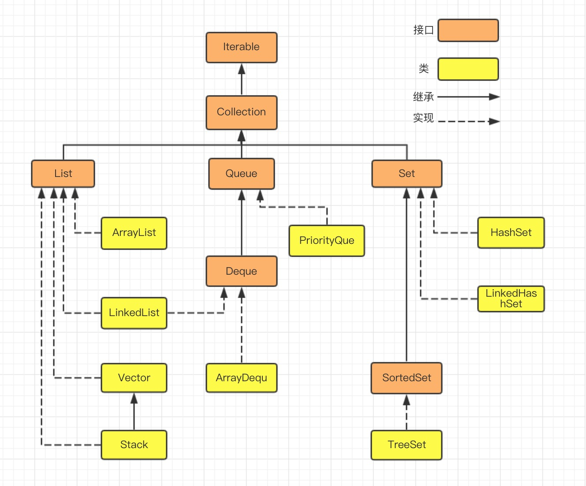

## String&Character
- character -> string: Character.toString(s)
- string -> character: String.charAt(i)
- string -> character array: string.toCharArray()
- character array -> string: new String(charArray)
- character(number) -> int: Character.getNumericValue(character)
- character(letter) -> int: character - 'a' or character - 'A'
- character check if it is uppercase: Character.isUpperCase(character)
- ASCII: lowercase character begin from 97, uppercase character begin from 65,there are 6 special character between lowercase and uppercase.

## List&Array
- ArrayList<Integer>->int[]:
  - Solution 1: 循环赋值到int[]中
  - Solution 2: 用intStream:用以下句子可以实现：
```java
int[] array = list.stream().mapToInt(i->i).toArray();
//or
int[] array = list.stream().mapToInt(Integer::intValue).toArray();
//其中list.stream()返回一个Object[]，我们要进一步将其转换成int[]，我们可以用以上两种方法(用到了mapToInt)将integer转换成int
```
- [Sream用法](#Stream用法)&[::用法](#::用法)

## Java Collections下的接口和继承关系简易结构图：
- Collection Class Diagram

- Map Class Diagram


## Stack&Queue
### Stack的方法
- 声明：Stack继承与Vector
- `boolean empty()`判断栈顶是否为空 $O(1)$
- `Object peek()`查看栈顶对象但是不移除 $O(1)$
- `Object pop()`移除栈顶对象，返回此对象 $O(1)$
- `Object push(Object element)`把元素压到栈中 $O(1)$
- `int search(Object element)`返回对象在栈中的位置，以1为基数(该查找是从后向前遍历，所以复杂度为$O(n)$)

### Queue的方法
- 用LinkedList初始化一个Queue，LinkedList implements Deque，而Deque继承与Queue，Dequeue是一个双向队列，而Queue是一个简单的FIFO队列
- LinkedList继承于Queue是可以当成是一个队列，其中方法：
  - `boolean offer(Object element)`加入元素，如果大于capacity抛出异常
  - `add(Object element)`加入元素，如果大于capacity返回false
  - `Object poll()`从队首取出元素返回并删除此元素，如果队列为空返回null
  - `Object remove()`从队首取出元素返回并删除此元素，如果队列为空抛出异常
  - `Object peek()`从队首取出元素返回不删除此元素，如果队列为空返回null
  - `Object element()`从队首取出元素返回不删除此元素，如果队列为空抛出异常

### 实现队列的三种方法

- 可以用继承于Vector的Stack，实现了Deque的ArrayDeque和实现了List和Deque的LinkedList实现队列
- 三者的组别
  - 底层数据存储方式  
    | Stack | ArrayDeque | LinkedList |  
    | :--- |:--- |:--- |
    | 长度为10的数组 | 长度为16的数组 | 链表 |
  - 方法参照表
    | Stack | ArrayDeque | LinkedList |  
    | :--- |:--- |:--- |
    | push(e) | addFirst(e)/offerFirst(e) | addFirst(e)/offerFirst(e) |
    | pop() | removeFirst()/pollFirst() | removeFirst()/pollFirst() |
    | peek() | getFirst()/peekFirst() | getFirst()/peekFirst() |
  - 线程安全
    | Stack | ArrayDeque | LinkedList |  
    | :--- |:--- |:--- |
    | 线程同步 | 线程不同步 | 线程不同步 |
  - 通常情况不推荐使用Vector以及其子类的Stack

1. 需要线程同步，使用Collections工具类中的synchronizedXXX()将不同步的数据结构转换成线程同步
2. 频繁的插入删除操作，未知初始数据量用LinkedList
3. 频繁的随机访问操作用ArrayDeque

### 逻辑运算符
- 异或：a和b两个值不相同，则异或结果为1，如果a和b相同，则异或结果为0

## Java 8新特性

### Stream用法

Java 8添加了新的抽象成为流stream，它类似于SQL从数据库查询数据的方式来提供一种对Java集合运算和表达的高阶抽象，这种风格将要处理的元素看作时流，流在管道中传输，可以在管道的节点进行处理(筛选，排序，聚合)，元素在管道中经过中间操作处理，最终由最终操作得到前面处理的结果

```java
List<Integer> transactionsIds = 
widgets.stream()
             .filter(b -> b.getColor() == RED)
             .sorted((x,y) -> x.getWeight() - y.getWeight())
             .mapToInt(Widget::getWeight)
             .sum();
```

在Java 8中可以生成串行流(stream())和并行流(parrallelStream())
### ::用法

::是lambda表达式的一种表达方式，当我们用lambda表达式创建匿名方法时既可以自定义方法也可以调用已有方法，而当调用已有方法的时候我们可以用`::`的方式调用。
- **调用静态方法**：
  - **Syntax**:(ClassName::methodeName)
  - **Example**:SomeClass::someStaticMethod
- **调用实例方法**：
  - **Syntax**:(objectOfClass::methodName)
  - **Example**:System.out::println
- **父类方法**
  - **Syntax**:(objectOfClass::methodName)
  - **Example**:(super::someSuperClassMethod)

```java
import java.util.*; 
import java.util.function.*; 
  
class Test { 
  
    // super function to be called 
    String print(String str) 
    { 
        return ("Hello " + str + "\n"); 
    } 
} 
  
class SubTest extends Test { 
  
    // instance method to override super method 
    @Override
    String print(String s) 
    { 
  
        // call the super method 
        // using double colon operator 
        Function<String, String> 
            func = super::print; 
  
        String newValue = func.apply(s); 
        newValue += "Bye " + s + "\n"; 
        System.out.println(newValue); 
  
        return newValue; 
    } 
  
    // Driver code 
    public static void main(String[] args) 
    { 
  
        List<String> list = new ArrayList<String>(); 
        list.add("Here"); 
        list.add("Is"); 
        list.add("A"); 
        list.add("TEST"); 
  
        // call the instance method 
        // using double colon operator 
        list.forEach(new SubTest()::print); 
    } 
} 
```

**Output:**
```
Hello Here
Bye Here

Hello Is
Bye Is

Hello A
Bye A

Hello TEST
Bye TEST
```
- **类构造器**
  - **Syntax**:(ClassName::new)
  - **Example**:(ArrayList::new)

### Java Functional Interfaces

- 仅仅有一个未实现的interface称为functional interface

    ```java
    public interface MyFunctionalInterface{
        public void execute();

        public default void print(String text) {
            System.out.println(text);
        }

        public static void print(String text, PrintWriter writer) throws IOException {
            writer.write(text);
        }
    }
    ```

    以上仍为functional interface，在Java 8中的interface中default和static方法可以实现
- Function Interface可以有lambda表达式实现
  
    ```java
    MyFunctionalInterface lambda = () -> {
        System.out.println("Executing...");
    }
    ```
    lambda表达式只能在声明Function Interface的时候使用

- Java内置Function Interface：
    
    **Function**:  
    Function Interface中的Function接受一个参数并且返回一个参数

    ```java
    public interface Function<T,R> {
        public <R> apply(T parameter);
    }
    ```
    除了apply方法外，在Function接口中有很多其他的方法，他们都是default方法，但是我们仅需实现apply方法即可

    - e.g

        ```java
        public class AddThree implements Function<Long, Long> {

            @Override
            public Long apply(Long aLong) {
                return aLong + 3;
            }
        }

        Function<Long, Long> adder = new AddThree();
        Long result = adder.apply((long) 4);
        System.out.println("result = " + result);
        ```
        我们还可以用lambda表达式:

    - e.g
        
        ```java
        Function<Long, Long> adder = (value) -> value + 3;
        Long resultLambda = adder.apply((long) 8);
        System.out.println("resultLambda = " + resultLambda);
        ```

        此时Function接口的实现内嵌在了变量的定义中而不是额外声明一个类

    Function接口中还有其他default或者static的方法我们可以选择性的重写：

    - `default <V> Function<V,R> compose(Function<? super V,? extends T> before)`
    - `default <V> Function<T,V> andThen(Function<? super R,? extends V> after)`
    - `static <T> Function<T,T> identity()`

### Level_Order_Traversal

```java
/**
 * Definition for a binary tree node.
 * public class TreeNode {
 *     int val;
 *     TreeNode left;
 *     TreeNode right;
 *     TreeNode() {}
 *     TreeNode(int val) { this.val = val; }
 *     TreeNode(int val, TreeNode left, TreeNode right) {
 *         this.val = val;
 *         this.left = left;
 *         this.right = right;
 *     }
 * }
 */
class Solution {
    public List<Integer> rightSideView(TreeNode root) {
        Queue<TreeNode> queue = new LinkedList<>();
        queue.offer(root);
        while(!queue.isEmpty()) {
            int size = queue.size();
            for(int i = 0; i < size; i++) {
                TreeNode node = queue.poll();
                if(node.left != null) {
                    queue.offer(node.left);
                }
                if(node.right != null) {
                    queue.offer(node.right);
                }
            }
        }
        return result;
    }
}
```

### Java 二维数组的长度可以不一样

```java
int[][] dirs = {{4, 6}, {6, 8}, {7, 9}, {4, 8}, {0, 3, 9}, {}, {0, 1, 7}, {2, 6}, {1, 9}, {4, 2}};
```
